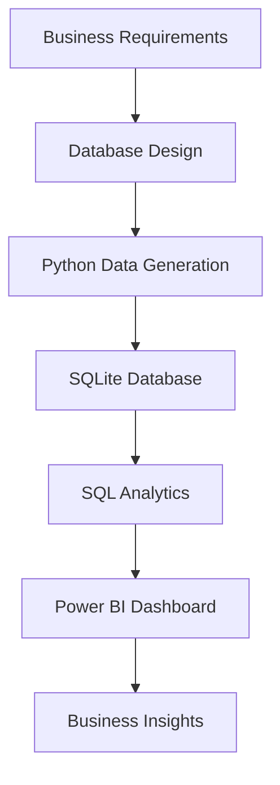

# Quick Commerce Dark Store Operations Analytics

An end-to-end Business Analyst project that simulates the operations of a quick-commerce platform. This project demonstrates business requirement analysis, database design, SQL analytics, and interactive Power BI dashboards to monitor operational performance across dark stores.

---

## Project Overview

The objective of this project is to analyze and monitor key operational metrics of a quick-commerce business, including:

- Order Performance
- Inventory Health
- Rider Performance
- Executive Business KPIs

The project follows a complete analytics workflow from business documentation to dashboard development.

---

## Tech Stack

- Python
- Pandas
- Faker
- SQL (SQLite)
- Power BI
- DAX
- Power Query
- Git & GitHub

---

## Project Workflow

Business Requirement Gathering
↓
Database Design
↓
Synthetic Data Generation (Python)
↓
SQLite Database
↓
SQL Analysis
↓
Power BI Dashboard
↓
Business Insights

---

## Project Architecture



## Database Tables

- Orders
- Order_Items
- Products
- Inventory
- Riders
- Stores

---

# Dashboards

## 1. Operations Dashboard

KPIs
- Total Revenue
- Total Orders
- Total Customers
- Average Order Value
- Average Delivery Time
- SLA Breach %

Visuals
- Revenue Trend
- Revenue by Category
- Revenue by Rider
- Payment Mode Distribution
- Order Status Distribution
- Average Delivery Time by City

### Dashboard Preview


---

## 2. Inventory Analytics Dashboard

KPIs
- Total SKUs
- Average System Stock
- Average Physical Stock
- Average Reserved Stock
- Average Damaged Stock

Visuals
- Inventory by Category
- System vs Physical Stock
- Stock Distribution by Store

### Dashboard Preview


---

## 3. Rider Performance Dashboard

KPIs
- Total Riders
- Average Deliveries
- Average Delivery Time
- SLA Performance

Visuals
- Orders by Rider
- Delivery Time by Rider
- Revenue by Rider
- Rider Shift Analysis

### Dashboard Preview


---


## 4. Executive Business Summary

Executive KPIs with high-level operational insights.

Visuals include:

- Revenue by City
- Orders by Category
- Payment Mode Distribution
- Order Status Distribution
  
### Dashboard Preview


---

## Business Documents

- Business Requirements Document (BRD)
- Project Scope
- ER Diagram
- Database Schema
- Data Dictionary
- Business Rules

---

## Key Skills Demonstrated

- Business Analysis
- SQL
- Data Cleaning
- Data Modeling
- Dashboard Design
- KPI Development
- Data Visualization
- Business Documentation
- Power BI
- DAX
- Power Query

---

## Repository Structure

```text
data/
database/
docs/
notebooks/
powerbi/
sql/
dashboard_screenshots/
```

---

## Future Enhancements

- Real-time SQL Server integration
- Automated ETL pipeline
- Predictive demand forecasting
- Inventory optimization
- Customer segmentation

---

## Author

Ajeet Yadav

Business Analyst | SQL | Power BI | Python
