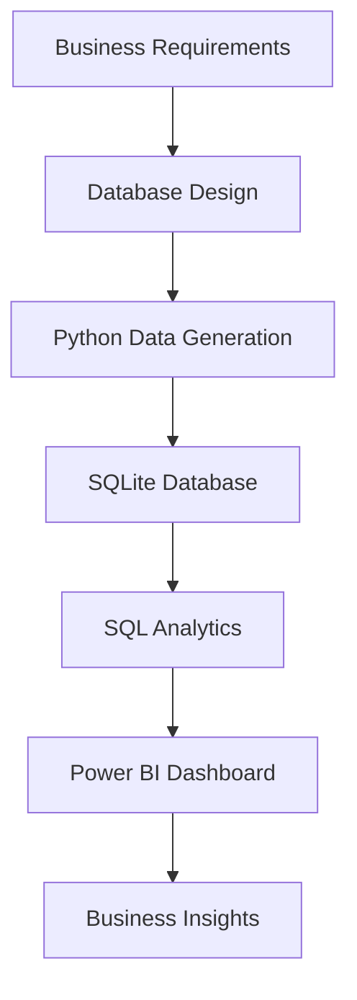
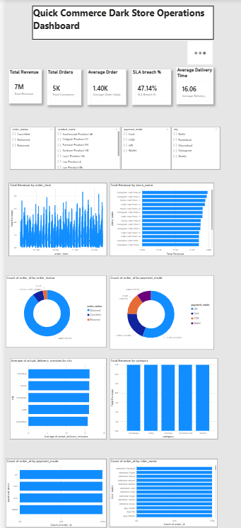
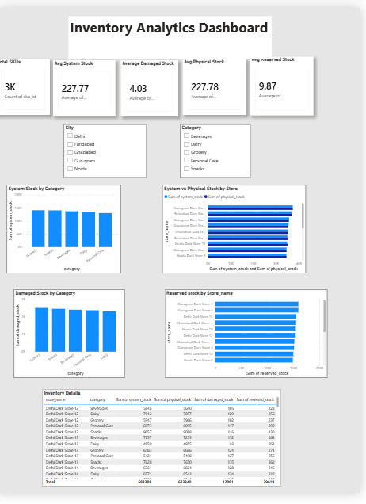
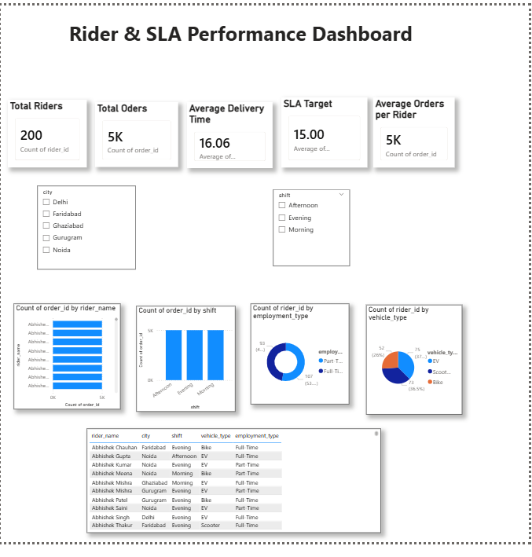
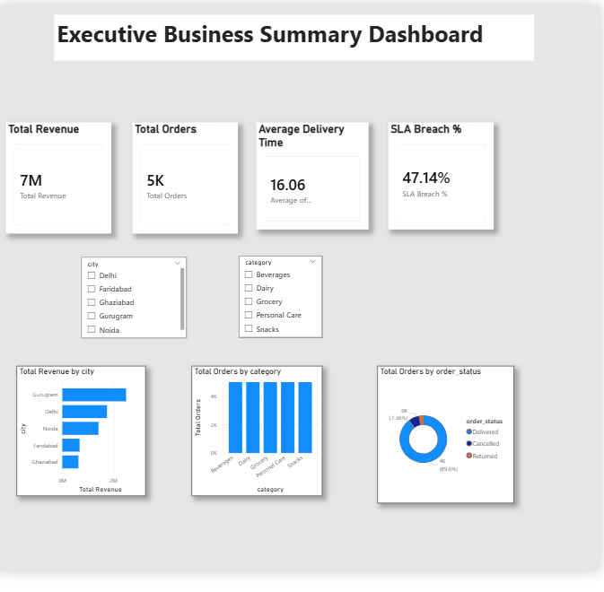

# Quick Commerce Dark Store Operations Analytics

An end-to-end Business Analyst project that simulates the operations of a quick-commerce platform. This project demonstrates business requirement analysis, database design, SQL analytics, and interactive Power BI dashboards to monitor operational performance across dark stores.

---

## 🎥 Dashboard Demo

Watch the complete dashboard walkthrough here:

➡️ [Download Dashboard Demo](demo/dashboard_demo.mp4)

## Project Overview

The objective of this project is to analyze and monitor key operational metrics of a quick-commerce business, including:

- Order Performance
- Inventory Health
- Rider Performance
- Executive Business KPIs

The project follows a complete analytics workflow from business documentation to dashboard development.

---

## Tech Stack

- Python
- Pandas
- Faker
- SQL (SQLite)
- Power BI
- DAX
- Power Query
- Git & GitHub

---

## Project Workflow

Business Requirement Gathering
↓
Database Design
↓
Synthetic Data Generation (Python)
↓
SQLite Database
↓
SQL Analysis
↓
Power BI Dashboard
↓
Business Insights

---

## Project Architecture



## Database Tables

- Orders
- Order_Items
- Products
- Inventory
- Riders
- Stores

---

# Dashboards

## 1. Operations Dashboard

KPIs
- Total Revenue
- Total Orders
- Total Customers
- Average Order Value
- Average Delivery Time
- SLA Breach %

Visuals
- Revenue Trend
- Revenue by Category
- Revenue by Rider
- Payment Mode Distribution
- Order Status Distribution
- Average Delivery Time by City

### Dashboard Preview



---

## 2. Inventory Analytics Dashboard

KPIs
- Total SKUs
- Average System Stock
- Average Physical Stock
- Average Reserved Stock
- Average Damaged Stock

Visuals
- Inventory by Category
- System vs Physical Stock
- Stock Distribution by Store

### Dashboard Preview



---

## 3. Rider Performance Dashboard

KPIs
- Total Riders
- Average Deliveries
- Average Delivery Time
- SLA Performance

Visuals
- Orders by Rider
- Delivery Time by Rider
- Revenue by Rider
- Rider Shift Analysis

### Dashboard Preview



---


## 4. Executive Business Summary

Executive KPIs with high-level operational insights.

Visuals include:

- Revenue by City
- Orders by Category
- Payment Mode Distribution
- Order Status Distribution
  
### Dashboard Preview



---


## Key Business Insights

### Revenue Performance
- The platform generated **₹7.0 Million** in total revenue from **5,000 completed orders**, demonstrating strong business volume during the analysis period.
- The estimated **Average Order Value (AOV)** was approximately **₹1,400 per order** (₹7M ÷ 5K orders), indicating healthy customer spending.

### Geographic Performance
- **Gurugram** was the highest revenue-generating city, contributing approximately **₹2.3–2.5 Million**, making it the strongest performing market.
- **Delhi** ranked second with roughly **₹1.8–2.0 Million** in revenue.
- **Noida, Faridabad, and Ghaziabad** generated comparatively lower revenue, highlighting opportunities for localized marketing and operational improvements.

### Delivery Performance
- The average delivery time was **16.06 minutes**, indicating that deliveries were completed close to the expected quick-commerce SLA.
- However, the dashboard reports an **SLA Breach Rate of 47.14%**, meaning **nearly 1 out of every 2 orders** exceeded the target delivery SLA. This represents the most critical operational improvement area.

### Product Category Analysis
- Orders were distributed across **five major product categories**:
  - Beverages
  - Dairy
  - Grocery
  - Personal Care
  - Snacks
- The category distribution appears balanced, ensuring revenue is not dependent on a single category and reducing category-specific business risk.

### Order Status Analysis
- **Delivered orders accounted for approximately 93.6%** of all orders (**around 4,680 out of 5,000 orders**), indicating strong operational execution.
- **Cancelled and Returned orders together represented approximately 6.4%** of total orders (**around 320 orders**), suggesting opportunities to reduce order failures and improve customer satisfaction.

### Executive Summary
- The dashboard consolidates revenue, operational, inventory, and delivery KPIs into a single executive view, enabling faster data-driven business decisions.
- Interactive filters for **City** and **Product Category** allow management to identify regional trends, compare performance, and support strategic planning.


## Business Recommendations

Based on the dashboard analysis, the following recommendations are suggested:

- Reduce SLA breaches by optimizing rider allocation and delivery routes in high-risk cities.
- Increase inventory audits to minimize stock mismatches between system and physical inventory.
- Prioritize expansion and marketing investments in high-performing cities such as Gurugram and Delhi.
- Improve order fulfillment processes to reduce cancellations and returns.
- Monitor rider productivity using delivery time and order completion KPIs.
- Use category-wise sales trends for inventory planning and demand forecasting.
- Implement automated alerts for dark stores with high SLA breach percentages.


## Power BI Features Used

- Interactive KPI Cards
- DAX Measures
- Power Query
- Data Modeling
- Relationships
- Slicers
- Cross Filtering
- Bar Charts
- Donut Charts
- Column Charts
- Executive Dashboard Design
- Drill-through Ready Layout


## SQL Concepts Used

- SELECT Statements
- INNER JOIN
- GROUP BY
- ORDER BY
- Aggregate Functions (SUM, COUNT, AVG)
- CASE Statements
- HAVING Clause
- Data Validation Queries
- Primary & Foreign Keys
- Database Schema Design


## Python Libraries Used

- Pandas
- NumPy
- Faker
- OpenPyXL
- SQLite3


## Skills Demonstrated

- Business Analysis
- Data Analysis
- SQL
- Power BI
- Python
- SQLite
- Dashboard Development
- Data Modeling
- Business Documentation
- KPI Development
- Data Validation
- Data Visualization
- Git & GitHub


## Business Documents

- Business Requirements Document (BRD)
- Project Scope
- ER Diagram
- Database Schema
- Data Dictionary
- Business Rules

---

## Key Skills Demonstrated

- Business Analysis
- SQL
- Data Cleaning
- Data Modeling
- Dashboard Design
- KPI Development
- Data Visualization
- Business Documentation
- Power BI
- DAX
- Power Query

---

## Repository Structure

```text
data/
database/
docs/
notebooks/
powerbi/
sql/
dashboard_screenshots/
```

---

## Automated Alerting

To simulate a real-world business monitoring workflow, an automation script was developed to identify high-risk dark stores based on operational performance.

### Features

- Connects to the operational database
- Calculates SLA Breach % for every dark store
- Flags stores exceeding the SLA threshold
- Generates an automated Excel summary report for business users
- Demonstrates how operational alerts can support proactive decision-making

**Script:** `scripts/alert_high_risk_stores.py`

**Generated Report:** `High_Risk_Dark_Stores_Report.xlsx`


## Future Enhancements

- Real-time SQL Server integration
- Automated ETL pipeline
- Predictive demand forecasting
- Inventory optimization
- Customer segmentation

---

## Author

Ajeet Yadav

Business Analyst | SQL | Power BI | Python
